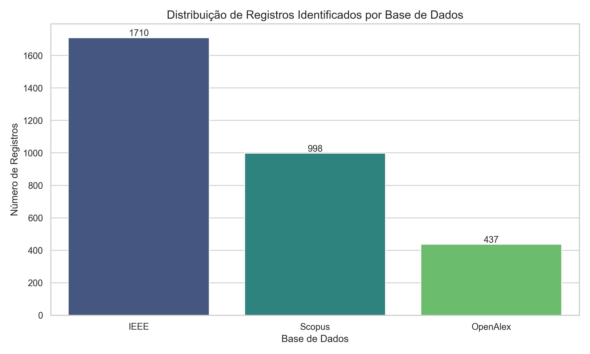
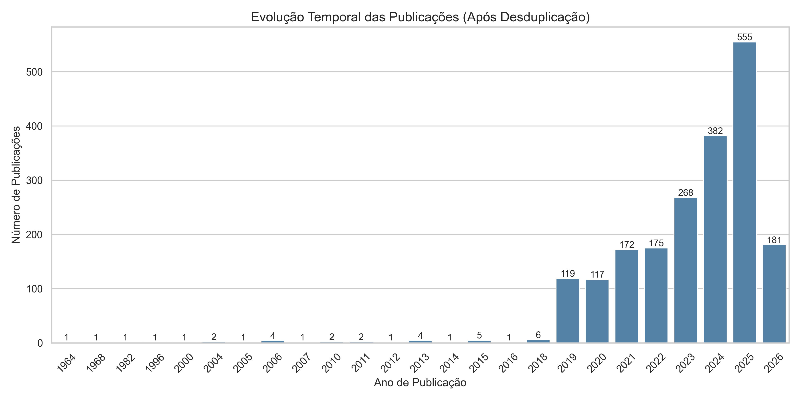

# Resultados do Mapeamento Sistemático

## 1. Visão Geral dos Registros

O fluxograma PRISMA baseia-se nos seguintes quantitativos:

- **Total de registros identificados:** 3145
  - Scopus: 998
  - Google Scholar: 0
  - Semantic Scholar: 0
  - IEEE Xplore: 1710
  - OpenAlex: 437
- **Duplicatas removidas:** 143
- **Registros após desduplicação:** 3002
- **Registros excluídos na triagem por título e resumo:** 2349
- **Estudos incluídos após triagem por título e resumo:** 653
- **Estudos incluídos após triagem por texto completo:** 0
- **Estudos excluídos na etapa de texto completo/elegibilidade:** 3
- **Estudos pendentes de recuperação ou leitura de texto completo:** 650

### 1.1 Distribuição nas Bases de Dados



### 1.2 Evolução Temporal das Publicações



### 1.3 Distribuição da Triagem Automática

```text
include_title_abstract
não       2349
talvez     584
sim         69
```

## 2. Caracterização dos Estudos Incluídos

A extração manual de dados ainda não foi concluída. As sínteses abaixo são preliminares e foram geradas automaticamente com base em título, resumo, notas de triagem e palavras-chave.

A base utilizada para esta síntese foi: **estudos incluídos após triagem por título e resumo**.

Total de registros analisados nesta síntese preliminar: **653**.

## 3. Técnicas de Inteligência Artificial Identificadas

- **Machine Learning:** 388 ocorrência(s) relativas (27.9% entre as categorias detectadas).
- **Deep Learning:** 308 ocorrência(s) relativas (22.2% entre as categorias detectadas).
- **Transformers/Attention:** 147 ocorrência(s) relativas (10.6% entre as categorias detectadas).
- **Artificial Intelligence:** 145 ocorrência(s) relativas (10.4% entre as categorias detectadas).
- **CNN:** 118 ocorrência(s) relativas (8.5% entre as categorias detectadas).
- **Generative AI:** 89 ocorrência(s) relativas (6.4% entre as categorias detectadas).
- **RNN/LSTM/GRU:** 76 ocorrência(s) relativas (5.5% entre as categorias detectadas).
- **Computer Vision/Pose Estimation:** 54 ocorrência(s) relativas (3.9% entre as categorias detectadas).
- **Recommendation Systems:** 35 ocorrência(s) relativas (2.5% entre as categorias detectadas).
- **Reinforcement Learning:** 29 ocorrência(s) relativas (2.1% entre as categorias detectadas).

## 4. Dados e Sinais de Entrada Utilizados

- **vídeo/imagem:** 450 ocorrência(s) relativas (45.9% entre as categorias detectadas).
- **áudio:** 226 ocorrência(s) relativas (23.1% entre as categorias detectadas).
- **MIDI/simbólico:** 124 ocorrência(s) relativas (12.7% entre as categorias detectadas).
- **gestos/movimento:** 95 ocorrência(s) relativas (9.7% entre as categorias detectadas).
- **dados multimodais:** 51 ocorrência(s) relativas (5.2% entre as categorias detectadas).
- **tablatura:** 24 ocorrência(s) relativas (2.4% entre as categorias detectadas).
- **dados de aprendizagem:** 10 ocorrência(s) relativas (1.0% entre as categorias detectadas).

## 5. Formas de Feedback e Avaliação de Performance

- **avaliação automática:** 225 ocorrência(s) relativas (32.8% entre as categorias detectadas).
- **análise de técnica:** 195 ocorrência(s) relativas (28.5% entre as categorias detectadas).
- **análise de pitch/ritmo:** 146 ocorrência(s) relativas (21.3% entre as categorias detectadas).
- **feedback visual:** 79 ocorrência(s) relativas (11.5% entre as categorias detectadas).
- **acompanhamento de progresso:** 15 ocorrência(s) relativas (2.2% entre as categorias detectadas).
- **feedback em tempo real:** 13 ocorrência(s) relativas (1.9% entre as categorias detectadas).
- **feedback personalizado:** 12 ocorrência(s) relativas (1.8% entre as categorias detectadas).

## 6. Aspectos Pedagógicos e Adaptatividade

- **adaptatividade:** 86 ocorrência(s) relativas (37.7% entre as categorias detectadas).
- **personalização:** 66 ocorrência(s) relativas (28.9% entre as categorias detectadas).
- **analytics/dashboards:** 30 ocorrência(s) relativas (13.2% entre as categorias detectadas).
- **trajetória de aprendizagem:** 29 ocorrência(s) relativas (12.7% entre as categorias detectadas).
- **sistema tutor inteligente:** 12 ocorrência(s) relativas (5.3% entre as categorias detectadas).
- **autorregulação:** 5 ocorrência(s) relativas (2.2% entre as categorias detectadas).

## 7. Respostas Preliminares às Questões de Pesquisa


### RQ1 — Quais tipos de sistemas de aprendizagem de guitarra/violão baseados em Inteligência Artificial têm sido propostos?

Com base na análise preliminar dos 653 registros da etapa de **estudos incluídos após triagem por título e resumo**, os sistemas mais recorrentes foram identificados por termos associados a aprendizagem, avaliação, feedback, transcrição, tablatura, datasets e personalização. A distribuição preliminar foi:

- **dataset/recurso para modelagem:** 253 ocorrência(s) relativas (40.0% entre as categorias detectadas).
- **sistema adaptativo/personalizado:** 159 ocorrência(s) relativas (25.2% entre as categorias detectadas).
- **sistema de aprendizagem:** 123 ocorrência(s) relativas (19.5% entre as categorias detectadas).
- **sistema de avaliação:** 38 ocorrência(s) relativas (6.0% entre as categorias detectadas).
- **sistema de feedback:** 30 ocorrência(s) relativas (4.7% entre as categorias detectadas).
- **sistema de transcrição/tablatura:** 29 ocorrência(s) relativas (4.6% entre as categorias detectadas).

Interpretação preliminar: a literatura recuperada parece se concentrar em sistemas de transcrição/tablatura, avaliação automática, feedback ao estudante, análise de performance e recursos computacionais para modelagem de execução musical. Essa interpretação ainda depende de validação por leitura completa.

### RQ2 — Quais técnicas de Inteligência Artificial, Aprendizado de Máquina e Aprendizado Profundo são empregadas nesses sistemas?

A triagem automática identificou os seguintes grupos técnicos nos títulos, resumos e notas dos estudos selecionados:

- **Machine Learning:** 388 ocorrência(s) relativas (27.9% entre as categorias detectadas).
- **Deep Learning:** 308 ocorrência(s) relativas (22.2% entre as categorias detectadas).
- **Transformers/Attention:** 147 ocorrência(s) relativas (10.6% entre as categorias detectadas).
- **Artificial Intelligence:** 145 ocorrência(s) relativas (10.4% entre as categorias detectadas).
- **CNN:** 118 ocorrência(s) relativas (8.5% entre as categorias detectadas).
- **Generative AI:** 89 ocorrência(s) relativas (6.4% entre as categorias detectadas).
- **RNN/LSTM/GRU:** 76 ocorrência(s) relativas (5.5% entre as categorias detectadas).
- **Computer Vision/Pose Estimation:** 54 ocorrência(s) relativas (3.9% entre as categorias detectadas).
- **Recommendation Systems:** 35 ocorrência(s) relativas (2.5% entre as categorias detectadas).
- **Reinforcement Learning:** 29 ocorrência(s) relativas (2.1% entre as categorias detectadas).

Interpretação preliminar: há predominância de abordagens de aprendizado de máquina e aprendizado profundo, especialmente redes neurais convolucionais, arquiteturas recorrentes, mecanismos de atenção/Transformers, visão computacional e modelos voltados à recomendação ou geração musical.

### RQ3 — Que tipos de dados e sinais de entrada esses sistemas utilizam para analisar a performance instrumental?

Os tipos de entrada mais detectados automaticamente foram:

- **vídeo/imagem:** 450 ocorrência(s) relativas (45.9% entre as categorias detectadas).
- **áudio:** 226 ocorrência(s) relativas (23.1% entre as categorias detectadas).
- **MIDI/simbólico:** 124 ocorrência(s) relativas (12.7% entre as categorias detectadas).
- **gestos/movimento:** 95 ocorrência(s) relativas (9.7% entre as categorias detectadas).
- **dados multimodais:** 51 ocorrência(s) relativas (5.2% entre as categorias detectadas).
- **tablatura:** 24 ocorrência(s) relativas (2.4% entre as categorias detectadas).
- **dados de aprendizagem:** 10 ocorrência(s) relativas (1.0% entre as categorias detectadas).

Interpretação preliminar: os estudos tendem a utilizar áudio, espectrogramas, sinais simbólicos, MIDI, tablaturas, vídeo, imagens, gestos, movimentos de mão e dados multimodais. Esses dados se relacionam diretamente à análise automática de execução, transcrição, reconhecimento de acordes e avaliação de técnica instrumental.

### RQ4 — De que forma os sistemas fornecem feedback e avaliam a performance dos estudantes?

Os mecanismos de feedback e avaliação mais identificados foram:

- **avaliação automática:** 225 ocorrência(s) relativas (32.8% entre as categorias detectadas).
- **análise de técnica:** 195 ocorrência(s) relativas (28.5% entre as categorias detectadas).
- **análise de pitch/ritmo:** 146 ocorrência(s) relativas (21.3% entre as categorias detectadas).
- **feedback visual:** 79 ocorrência(s) relativas (11.5% entre as categorias detectadas).
- **acompanhamento de progresso:** 15 ocorrência(s) relativas (2.2% entre as categorias detectadas).
- **feedback em tempo real:** 13 ocorrência(s) relativas (1.9% entre as categorias detectadas).
- **feedback personalizado:** 12 ocorrência(s) relativas (1.8% entre as categorias detectadas).

Interpretação preliminar: os sistemas recuperados indicam uso de avaliação automática, feedback visual, feedback em tempo real, análise de pitch, ritmo, tempo, técnica, postura, posição dos dedos e acompanhamento de progresso. A profundidade pedagógica desses feedbacks ainda precisa ser confirmada por leitura integral.

### RQ5 — Como os sistemas incorporam aspectos pedagógicos, como adaptatividade, personalização de trajetórias de estudo, progressão de dificuldades e visualizações/analytics do desempenho?

Os elementos pedagógicos detectados automaticamente foram:

- **adaptatividade:** 86 ocorrência(s) relativas (37.7% entre as categorias detectadas).
- **personalização:** 66 ocorrência(s) relativas (28.9% entre as categorias detectadas).
- **analytics/dashboards:** 30 ocorrência(s) relativas (13.2% entre as categorias detectadas).
- **trajetória de aprendizagem:** 29 ocorrência(s) relativas (12.7% entre as categorias detectadas).
- **sistema tutor inteligente:** 12 ocorrência(s) relativas (5.3% entre as categorias detectadas).
- **autorregulação:** 5 ocorrência(s) relativas (2.2% entre as categorias detectadas).

Interpretação preliminar: há indícios de personalização, adaptatividade, recomendação de conteúdos, trajetórias de aprendizagem, analytics e acompanhamento de progresso. Entretanto, parte dos estudos pode tratar esses elementos apenas em nível técnico ou conceitual, exigindo validação na extração de dados.

### RQ6 — Quais lacunas técnicas e pedagógicas permanecem na literatura?

As lacunas e desafios mais sugeridos pelos títulos e resumos foram:

- **lacunas de avaliação empírica:** 378 ocorrência(s) relativas (71.2% entre as categorias detectadas).
- **generalização limitada:** 77 ocorrência(s) relativas (14.5% entre as categorias detectadas).
- **baixa integração pedagógica:** 41 ocorrência(s) relativas (7.7% entre as categorias detectadas).
- **falta de feedback em tempo real:** 26 ocorrência(s) relativas (4.9% entre as categorias detectadas).
- **limitação de datasets:** 9 ocorrência(s) relativas (1.7% entre as categorias detectadas).

Interpretação preliminar: as principais lacunas prováveis envolvem limitação de datasets, dificuldade de generalização, falta de validação com estudantes, fragilidade pedagógica na definição do feedback, baixa personalização real e necessidade de integração entre análise técnica da performance e objetivos educacionais.


## 8. Observação Metodológica

As respostas apresentadas neste relatório são preliminares quando não houver `data_extraction_completed.csv` preenchido. Nesse caso, a síntese é baseada em mineração automática de termos nos campos de título, resumo e notas da triagem. A interpretação final deve ser validada por leitura dos estudos incluídos e preenchimento do template de extração de dados.

